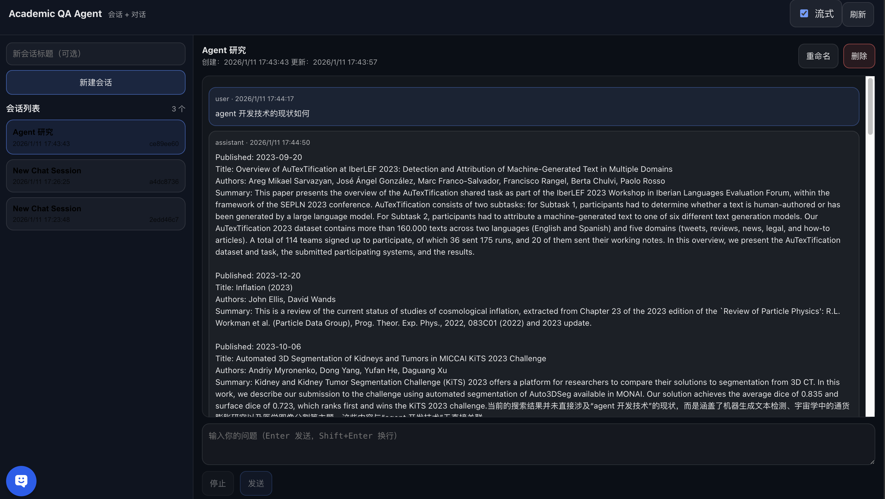

# Academic_Question_Answering_Agent

>这是一个面向学术问题的全栈问答智能体：前端提供多会话聊天界面，后端用 FastAPI + SQLite 持久化对话，并通过 LangChain 集成 arXiv 工具辅助检索与总结论文。



## 项目描述
- 产品形态：一个面向“学术问题”的聊天应用。用户提出研究问题，系统通过大模型生成回答，并在需要时调用学术检索工具来增强可信度与可追溯性。
- 核心能力：
  - 多轮对话：以会话为单位保存历史消息，刷新页面后仍可恢复。
  - 工具增强：Agent 可触发工具调用（tool calls），将检索结果转化为面向用户的总结与建议。
  - 流式体验：支持 SSE 流式返回，前端逐 token 拼接，结束后一次性落库，保证数据库内容是权威最终稿。
- 交付目标：前后端协议稳定、消息落库顺序正确、工具调用信息可见（用于调试与可解释性），并确保新增功能不破坏现有 API 契约。

## 快速开始
### 1.安装依赖
- Python：
  - `pip install -r requirements.txt`
- Node：
  - `npm --prefix frontend install`

### 2.配置后端环境变量
后端会读取 `backend/.env`。至少需要 OpenAI 兼容接口的三要素：模型名、API Key、Base URL。

把 `YOUR_MODEL`、`YOUR_KEY`、`YOUR_BASE_URL` 替换为你的真实值：

```bash
BAI_LIAN_MODEL=YOUR_MODEL
BAI_LIAN_API_KEY=YOUR_KEY
BAI_LIAN_BASE_URL=YOUR_BASE_URL
```
### 3.启动服务
- 启动后端（在 backend 目录下）：
  - `uvicorn app.main:app --reload --host 0.0.0.0 --port 8000`
- 启动前端（在项目根目录）：
  - `npm --prefix frontend run dev`
### 4.验证
- 后端文档：`http://127.0.0.1:8000/docs`
- 前端页面：默认 `http://localhost:5173`


## 1) 端到端数据流
- 用户在前端输入问题 → 前端调用后端 API。
- 后端先把 user 消息写入 SQLite → 调用全局 `agent_service` 让模型生成 → 再把 assistant 消息写回 SQLite。
- 前端刷新会话详情时，会从后端拿到完整的消息列表（按时间升序）。

## 2) 前端架构（Vue 3 + Vite）
- 单页组件维护 3 个核心状态：会话列表、当前会话、消息列表。
- 发送逻辑：
  - 先“乐观插入”用户消息到当前列表。
  - 流式模式：插入一个 assistant draft 消息并持续追加 token。
  - 最终：刷新会话与会话详情，以拿到数据库中的权威消息/updated_at。
- 开发代理：保持调用相对路径 `/api/...`；本地由 Vite 转发到 `http://127.0.0.1:8000`。

## 3) 后端架构（FastAPI + SQLAlchemy + LangChain）

>

<div style="max-height:460px; overflow-y:auto; padding:8px 4px; border:1px solid #d0d7de; border-radius:12px; scroll-snap-type:y mandatory; -webkit-overflow-scrolling:touch;">
  <div style="scroll-snap-align:start; border:1px solid #d0d7de; border-radius:12px; padding:12px; margin:10px 0;">
    <strong>启动与生命周期</strong>
    <ul>
      <li>应用启动使用 <code>lifespan</code>：启动时自动建表。</li>
      <li>启动时调用 <code>create_tables</code>（对应 <code>database.py</code>）。</li>
    </ul>
  </div>

  <div style="scroll-snap-align:start; border:1px solid #d0d7de; border-radius:12px; padding:12px; margin:10px 0;">
    <strong>数据层分层</strong>
    <ul>
      <li><strong>ORM 模型</strong>：会话表 + 消息表；会话删除会级联删除消息。</li>
      <li><strong>CRUD</strong>：数据库写入/查询集中在 CRUD 层完成。</li>
      <li><strong>API</strong>：路由函数负责参数校验 / 拼装 history / 调用 agent / 返回响应。</li>
    </ul>
  </div>

  <div style="scroll-snap-align:start; border:1px solid #d0d7de; border-radius:12px; padding:12px; margin:10px 0;">
    <strong>Agent 层</strong>
    <ul>
      <li>使用 <code>create_agent(...)</code> 创建 agent，并加载 <code>arxiv</code> 工具。</li>
      <li>OpenAI 兼容接口三要素：模型名、API Key、Base URL（由环境变量提供）。</li>
      <li>全局单例：后端进程内复用同一个 agent 实例。</li>
    </ul>
  </div>

  <div style="scroll-snap-align:start; border:1px solid #d0d7de; border-radius:12px; padding:12px; margin:10px 0;">
    <strong>文件职责速览</strong>
    <ul>
      <li><code>main.py</code>：应用入口；<code>include_router</code> 挂载路由；启动时建表。</li>
      <li><code>api.py</code>：定义 <code>/api/chat/...</code> 接口；依赖注入 <code>get_db</code>；调用 <code>crud.py</code>；调用 <code>agent_service</code> 生成回答并落库。</li>
      <li><code>database.py</code>：SQLite 引擎与会话工厂；提供 <code>get_db</code> 与 <code>create_tables</code>。</li>
      <li><code>crud.py</code>：会话与消息的增删改查封装。</li>
      <li><code>models.py</code>：<code>ChatSession</code>/<code>ChatMessage</code> 表结构与关联、级联删除。</li>
      <li><code>schemas.py</code>：Pydantic 请求/响应；<code>tool_calls</code>/<code>tool_results</code> 可选字段用于保留工具调用信息。</li>
    </ul>
  </div>
</div>

## 4) 数据模型与落库规则
- `ChatSession`：`id/title/created_at/updated_at`。
- `ChatMessage`：`id/session_id/role/content/created_at`，以及可选 `tool_calls/tool_results`（字符串形式，通常是 JSON 字符串）。
- 落库顺序（重要）：
  - 无论流式还是非流式：先落 user 消息，再落 assistant 消息。
  - 非流式：assistant 返回内容一次性落库；`tool_calls/tool_results` 也随之落库。
  - 流式：前端实时拼接 token；后端在流式结束时把完整 assistant 内容一次性落库。

## 5) API 设计与约定
### 会话
- `GET /api/chat/sessions`：返回会话列表。
- `POST /api/chat/sessions`：创建会话（title 可选）。
- `GET /api/chat/sessions/{id}`：返回会话 + messages（messages 按时间升序）。
- `PUT /api/chat/sessions/{id}`：更新标题。
- `DELETE /api/chat/sessions/{id}`：删除会话（会级联删除消息）。

### 发送消息（非流式）
- `POST /api/chat/message`
  - body：`{ session_id, message, stream:false }`
  - 返回：`{ session_id, message, is_complete:true }`
  - 约定：后端会把 assistant 的最终消息落库，并返回该条消息对象。

### 发送消息（流式 SSE）
- `POST /api/chat/stream`，响应类型 `text/event-stream`
- 前端解析规则（不要随意修改）：
  - SSE 事件用**空行**分隔。
  - 只处理以 `data:` 开头的行。
  - `data: [DONE]` 表示结束，前端收到后立即停止读取。
- 事件负载 JSON 约定：
  - 内容块：`{"content":"<token>","is_final":false}`
  - 最终块：`{"content":"","is_final":true,"tool_calls":[...]}`
  - 当前实现：`tool_calls` 只会出现在最终块（如有）。


## 6) API 调用示例
### 创建会话
```bash
curl -s -X POST http://127.0.0.1:8000/api/chat/sessions \
  -H 'Content-Type: application/json' \
  -d '{"title":"New Chat Session"}'
```

### 非流式提问
```bash
curl -s -X POST http://127.0.0.1:8000/api/chat/message \
  -H 'Content-Type: application/json' \
  -d '{"session_id":"<SESSION_ID>","message":"帮我总结近两年关于 RAG 评测的论文","stream":false}'
```

### 流式提问（SSE）
```bash
curl -N -X POST http://127.0.0.1:8000/api/chat/stream \
  -H 'Content-Type: application/json' \
  -H 'Accept: text/event-stream' \
  -d '{"session_id":"<SESSION_ID>","message":"搜索并推荐 3 篇相关 arXiv 论文","stream":true}'
```

